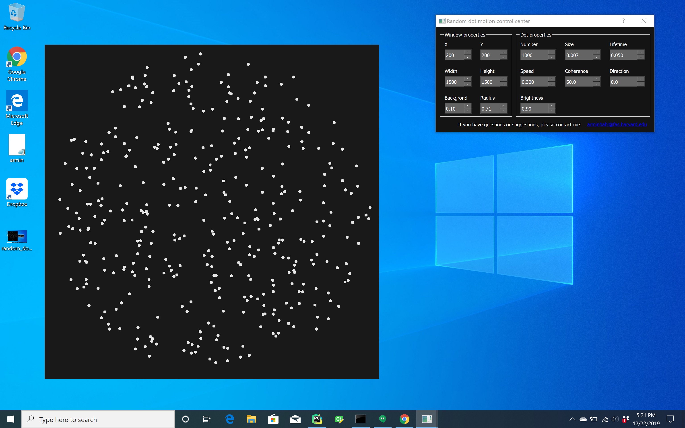

# Random dot motion control center
Welcome to the random dot motion control center!

This set of python files provides a simple and easy-to-use toolbox for displaying random dot motion stimuli. It comes 
with a convenient graphical user interface where important stimulus features, such as coherence, dot lifetime, or 
motion direction, can be setup in real-time. The framework is designed in such a way that it is expandable with 
additional parallel modules. For example, one might add a module that tracks the position and orientation of a freely swimming 
larval zebrafish or a freely walking _Drosophila_, and then make certain stimulus features dependent on these measured behavioral features.

The display of visual stimuli is based on the python-friendly gaming engine [Panda3D](https://www.panda3d.org/). 
I use vertex shaders to move and resize dots. While Panda3D generally supports all platforms, I did not manage to use 
shaders on platforms others than Windows. Please let me know if you get it to run on Linux or MacOS.

## Installation
Install the latest version of Python 3. I am using the Anaconda distribution.

To install Anaconda, download the installer from the [Anaconda website](https://www.anaconda.com/distribution/#download-section).
Then go to the Anaconda Prompt and create a new environment:

    conda create --name py37 --channel conda-forge python=3.7
    conda activate py37
    conda install -c conda-forge scipy pyqt
    pip install panda3d
    
Get the source code from my github repository and start the graphical user interface:

    git clone https://github.com/arminbahl/random_dot_motion
    cd random_dot_motion
    python start_gui.py

If you prefer a proper developer environment for editing and running code, I suggest [PyCharm](https://www.jetbrains.com/pycharm/).

Once you start the program, you should see two windows, one displaying the visual stimulus and one that controls the 
relevant features of the stimulus.

If you have questions or suggestions, please let me know: [arminbahl@fas.harvard.edu](mailto:arminbahl@fas.harvard.edu)

## References
1.	Bahl, A., and Engert, F. (2020). Neural circuits for evidence accumulation and decision making in larval zebrafish. Nat. Neurosci. 23, 94–102.
2.	Newsome, W.T., and Paré, E.B. (1988). A selective impairment of motion perception following lesions of the middle temporal visual area (MT). J. Neurosci. 8, 2201–2211.